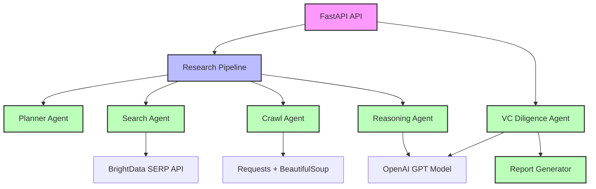
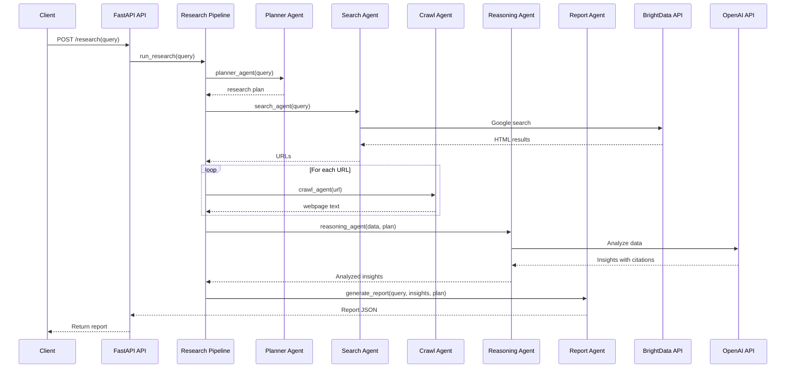

# Autonomous Company Deep Research Agent - Architecture and Technical Documentation

## Project Overview

The Autonomous Company Deep Research Agent is an AI-powered system designed to automate comprehensive company and startup research. It integrates multiple agents and services to conduct end-to-end research, from planning and data collection to analysis and report generation.

## System Architecture



## Core Components

### 1. FastAPI Web Server

**File:** [`app/main.py`](app/main.py)

- **Purpose:** Provides a RESTful API interface for the research system
- **Endpoints:**
  - `GET /` - Health check endpoint
  - `POST /research` - Main research endpoint that accepts queries and returns reports
  - `POST /generate-vc-report` - Generates VC-style diligence reports in PDF or Markdown format
  - `GET /company/funding` - Get funding history for a company
  - `GET /startup/competitors` - Get competitors for a company (alternative endpoint)
  - `GET /company/competitors` - Get competitors for a company
  - `GET /company/founders` - Get founder information for a company
  - `GET /company/hiring` - Get hiring signals for a company
  - `GET /company/news` - Get news intelligence for a company
  - `GET /company/technology` - Get technology stack for a company

```python
@app.post("/research")
async def research(query: str, country: str = "US"):
    result = await run_research(query, country)
    return result

@app.post("/generate-vc-report")
async def generate_vc_report(request: VCReportRequest):
    research_data = await run_research(request.company, request.country)
    agent = VCDiligenceAgent()
    report = agent.run(request.company, research_data)
    report_path = generate_report(report, request.format)
    return FileResponse(path=report_path, filename=report_path.split("/")[-1], media_type="application/pdf" if request.format == "pdf" else "text/markdown")
```

### 2. Research Pipeline

**File:** [`services/research_pipeline.py`](services/research_pipeline.py)

- **Purpose:** Orchestrates the entire research process
- **Flow:**
  1. Receives user query
  2. Generates research plan
  3. Searches for relevant URLs
  4. Crawls and collects data from each URL
  5. Analyzes collected data
  6. Generates final report

```python
async def run_research(query):
    plan = planner_agent(query)
    urls = search_agent(query)
    research_data = []
    for url in urls:
        text = crawl_agent(url)
        research_data.append({
            "url": url,
            "content": text
        })
    insights = reasoning_agent(research_data, plan)
    report = generate_report(query, insights, plan)
    return report
```

### 3. Agents

#### Planner Agent
**File:** [`agents/planner_agent.py`](agents/planner_agent.py)

- **Purpose:** Generates a dynamic, tailored research plan based on the query using OpenAI's GPT model
- **Output:** List of specific, actionable research steps (typically 8-10 steps)
- **Technology:** OpenAI GPT-4o

```python
from openai import OpenAI
from app.config import OPENAI_API_KEY, OPENAI_MODEL

client = OpenAI(api_key=OPENAI_API_KEY)

def planner_agent(query):
    """
    Generates a dynamic research plan based on the given query using OpenAI.
    
    Args:
        query (str): The research query (e.g., "Analyze startup Cursor AI")
    
    Returns:
        list: Structured research plan with specific steps
    """
    
    prompt = f"""
You are a research planning expert. Create a concise, actionable research plan for the following query:

"{query}"

The plan should be structured as a list of 6-10 specific, sequential steps that a research pipeline can execute.
...
"""
    
    try:
        response = client.responses.create(
            model=OPENAI_MODEL,
            input=prompt
        )
        # Parse and validate response
        ...
        return plan
    except Exception as e:
        # Fallback to default plan if OpenAI fails
        return [
            "Search for information about the company/topic",
            "Collect relevant articles and data",
            "Extract key details about the subject",
            "Identify competitors and market landscape",
            "Analyze market opportunities and risks",
            "Evaluate business model and value proposition",
            "Generate investment thesis and recommendations"
        ]
```

#### Search Agent
**File:** [`agents/search_agent.py`](agents/search_agent.py)

- **Purpose:** Searches for relevant URLs using Google Search
- **Technology:** BrightData SERP API + BeautifulSoup

```python
def search_agent(query):
    results = serp_search(query)
    soup = BeautifulSoup(results['content'], "html.parser")
    result_containers = soup.find_all("div", class_="g") + soup.find_all("div", class_="tF2Cxc")
    # Extract and filter valid URLs
    return urls[:5]
```

#### Crawl Agent
**File:** [`agents/crawl_agent.py`](agents/crawl_agent.py)

- **Purpose:** Extracts text content from web pages
- **Technology:** Requests + BeautifulSoup

```python
def crawl_agent(url):
    try:
        r = requests.get(url, timeout=10)
        soup = BeautifulSoup(r.text, "html.parser")
        text = soup.get_text(separator=" ")
        return text[:10000]
    except:
        return ""
```

#### Reasoning Agent
**File:** [`agents/reasoning_agent.py`](agents/reasoning_agent.py)

- **Purpose:** Analyzes collected data and generates insights
- **Technology:** OpenAI GPT-4o
- **Key Features:**
  - Summarizes company information
  - Extracts founder details
  - Identifies competitors
  - Analyzes market opportunities and risks
  - Generates investment thesis
  - **Includes citations** with source URLs

```python
def reasoning_agent(data, plan):
    # Format data with sources
    formatted_data = ""
    for i, item in enumerate(data):
        formatted_data += f"Source {i+1} ({item['url']}):\n{item['content']}\n\n"
    
    prompt = f"""
You are a venture capital research analyst.
...
For each key piece of information, include citations to the source numbers (e.g., [1], [2], etc.) from which the information was derived.
...
"""

    response = client.responses.create(
        model=OPENAI_MODEL,
        input=prompt
    )
    
    # Add sources list to result
    try:
        import json
        insights_json = json.loads(insights)
        insights_json["sources"] = [item["url"] for item in data]
        return json.dumps(insights_json, indent=2)
    except:
        return f"{insights}\n\nSources:\n" + "\n".join([f"[{'1' if i ==0 else i+1}] {item['url']}" for i, item in enumerate(data)])
```

#### VC Diligence Agent
**File:** [`agents/vc_diligence_agent.py`](agents/vc_diligence_agent.py)

- **Purpose:** Transforms raw research data into a structured VC-style diligence report
- **Technology:** OpenAI GPT model
- **Output:** VCReport object (Pydantic model) with comprehensive report sections

```python
class VCDiligenceAgent:
    def __init__(self):
        self.model = OPENAI_MODEL
    
    def run(self, company: str, research_data: dict) -> VCReport:
        prompt = VC_PROMPT.format(
            company=company,
            plan=research_data['plan'],
            insights=research_data['analysis']
        )
        
        response = client.chat.completions.create(
            model=self.model,
            messages=[{"role": "user", "content": prompt}],
            response_format={"type": "json_object"}
        )
        
        text = response.choices[0].message.content
        data = json.loads(text)
        report = VCReport(**data)
        return report
```

#### Report Generator
**File:** [`services/report_generator.py`](services/report_generator.py)

- **Purpose:** Converts VCReport objects to Markdown and PDF formats
- **Technology:** markdown2 + wkhtmltopdf
- **Output:** File path to generated report

```python
def generate_report(report: VCReport, output_format: str = "pdf") -> str:
    # Generate Markdown
    markdown_content = generate_markdown(report)
    
    # Save Markdown file
    markdown_path = f"reports/{slugify(report.company_name)}_report.md"
    with open(markdown_path, "w", encoding="utf-8") as f:
        f.write(markdown_content)
    
    # Convert to PDF if requested
    if output_format == "pdf":
        pdf_path = f"reports/{slugify(report.company_name)}_report.pdf"
        markdown_to_pdf(markdown_content, pdf_path)
        return pdf_path
    else:
        return markdown_path
```

### 4. Services

#### BrightData Service
**File:** [`services/brightdata_service.py`](services/brightdata_service.py)

- **Purpose:** Interfaces with BrightData's SERP API
- **Key Features:**
  - Handles API authentication
  - Manages request/response
  - Handles errors

```python
def serp_search(query):
    url = "https://api.brightdata.com/request"
    encoded_query = quote(query)
    payload = {
        "zone": BRIGHTDATA_ZONE,
        "url": f"https://www.google.com/search?q={encoded_query}",
        "format": "raw"
    }
    headers = {
        "Authorization": f"Bearer {BRIGHTDATA_API_KEY}"
    }
    # Send request and handle response
```

## Configuration

**File:** [`app/config.py`](app/config.py)

- **Environment Variables:**
  - `BRIGHTDATA_API_KEY` - BrightData API authentication key
  - `BRIGHTDATA_ZONE` - BrightData zone (e.g., `serp_api1`)
  - `OPENAI_API_KEY` - OpenAI API key
  - `OPENAI_MODEL` - GPT model to use (default: `gpt-4o`)

```python
from dotenv import load_dotenv
import os

load_dotenv()

BRIGHTDATA_API_KEY = os.getenv("BRIGHTDATA_API_KEY")
BRIGHTDATA_ZONE = os.getenv("BRIGHTDATA_ZONE")
OPENAI_API_KEY = os.getenv("OPENAI_API_KEY")
OPENAI_MODEL = os.getenv("OPENAI_MODEL", "gpt-4o")
```

## Installation and Setup

**File:** [`requirements.txt`](requirements.txt)

- **Dependencies:**
  - fastapi - Web framework
  - uvicorn - ASGI server
  - requests - HTTP client
  - beautifulsoup4 - HTML parser
  - python-dotenv - Environment variables
  - openai - OpenAI API client

```bash
pip install -r requirements.txt
```

**File:** [`.env`](.env)

- **Example Configuration:**

```env
BRIGHTDATA_API_KEY=your_brightdata_api_key
BRIGHTDATA_ZONE=serp_api1
OPENAI_API_KEY=your_openai_api_key
OPENAI_MODEL=gpt-4o
```

## Running the System

```bash
uvicorn app.main:app --reload
```

**API Usage:**

```bash
curl -X POST "http://localhost:8000/research" -H "Content-Type: application/json" -d '{"query": "Analyze startup Cursor AI"}'
```

## Data Flow Diagram



## Key Features

1. **End-to-end Automation:** Handles all aspects of research from query to report
2. **Multiple Data Sources:** Collects data from search results, company websites, and Wikipedia
3. **Citation System:** Each piece of information is cited with source URLs
4. **VC-style Analysis:** Generates investment thesis, market analysis, and risk assessment
5. **Scalable Architecture:** Components are modular and can be extended
6. **Error Handling:** Robust error handling for API calls and web requests

## Technical Stack

- **Backend:** Python 3.10+
- **Web Framework:** FastAPI
- **API Server:** Uvicorn
- **Search:** BrightData SERP API
- **Web Scraping:** BeautifulSoup + Requests
- **LLM:** OpenAI GPT-4o
- **Environment Management:** python-dotenv

## Extensibility

The system is designed to be modular and extensible:

1. **Add New Data Sources:** Extend the search and crawl agents
2. **Enhance Analysis:** Modify the reasoning agent prompt
3. **Custom Reports:** Modify the report generation agent
4. **Alternative APIs:** Replace BrightData with other search APIs
5. **Different LLMs:** Replace OpenAI with other LLM providers

## Performance Considerations

- **Rate Limiting:** BrightData API has request limits
- **Crawling Speed:** Respect robots.txt and add delays
- **API Costs:** Monitor usage of paid services (BrightData, OpenAI)
- **Error Handling:** Implement retries and fallbacks

## Security

- **API Keys:** Store in environment variables
- **CORS:** Configure appropriately for production
- **Input Validation:** Sanitize user input
- **Error Messages:** Avoid exposing sensitive information

## Future Improvements

1. **Database Integration:** Store reports for historical analysis
2. **Advanced Search:** Add semantic search capabilities
3. **Multi-language Support:** Handle queries in different languages
4. **Real-time Updates:** Monitor companies for changes
5. **Interactive UI:** Add a frontend for better user experience
