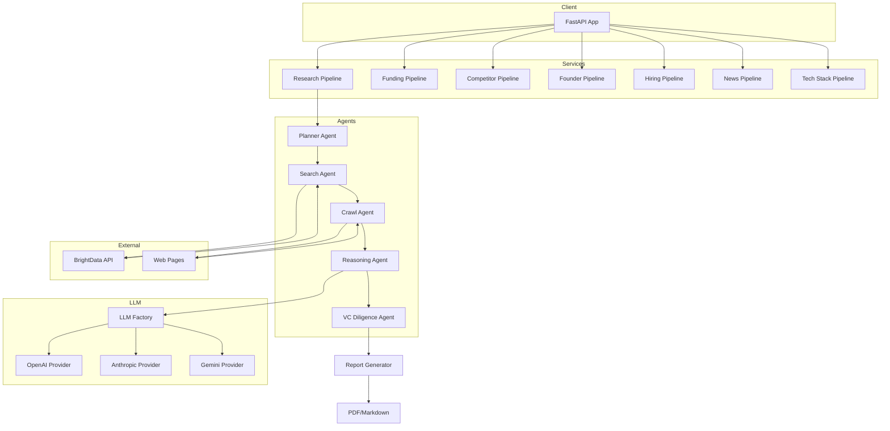
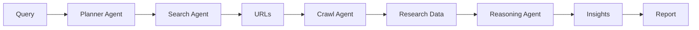
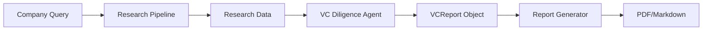

# Autonomous Company Deep Research Agent - Technical Documentation

**Version:** 1.0.0  
**Last Updated:** 2026-03-22

---

## Table of Contents

1. [System Overview](#system-overview)
2. [Architecture](#architecture)
3. [Components](#components)
4. [API Reference](#api-reference)
5. [Data Models](#data-models)
6. [Configuration](#configuration)
7. [Pipeline Workflows](#pipeline-workflows)
8. [Error Handling](#error-handling)
9. [Extension Points](#extension-points)

---

## System Overview

The Autonomous Company Deep Research Agent is an AI-powered system designed to automate comprehensive research on any topic. It leverages Large Language Models (LLMs) to plan, execute, and synthesize research from web sources.

### Core Capabilities

- **Automated Research Planning**: Generates structured research plans based on queries
- **Web Search Integration**: Searches for relevant URLs using BrightData SERP API
- **Content Extraction**: Crawls and extracts text content from web pages
- **LLM-Powered Analysis**: Analyzes collected data using GPT-4, Claude, or Gemini
- **Report Generation**: Produces structured reports in Markdown or PDF format

### Use Cases

- Venture capital due diligence
- Competitive intelligence
- Market research
- Academic research
- Company profiling

---

## Architecture

### High-Level Architecture



### Directory Structure

```
autonomous-deep-research-agent/
├── agents/                    # Agent implementations
│   ├── planner_agent.py       # Research plan generation
│   ├── search_agent.py        # Web search functionality
│   ├── crawl_agent.py         # Web content extraction
│   ├── reasoning_agent.py     # Data analysis & insights
│   ├── vc_diligence_agent.py  # VC-style report generation
│   ├── founder_research_agent.py
│   ├── funding_extraction_agent.py
│   ├── competitor_detection_agent.py
│   ├── hiring_signals_agent.py
│   ├── news_intelligence_agent.py
│   └── technology_stack_agent.py
│
├── llm/                       # LLM provider abstraction
│   ├── base.py               # Base provider interface
│   ├── factory.py            # Provider factory
│   ├── openai_provider.py    # OpenAI implementation
│   ├── anthropic_provider.py # Anthropic implementation
│   └── gemini_provider.py    # Google Gemini implementation
│
├── services/                  # Pipeline implementations
│   ├── research_pipeline.py  # Main research pipeline
│   ├── report_generator.py   # PDF/Markdown generation
│   ├── funding_research_pipeline.py
│   ├── competitor_research_pipeline.py
│   ├── founder_research_pipeline.py
│   ├── hiring_signals_pipeline.py
│   ├── news_intelligence_pipeline.py
│   └── technology_stack_pipeline.py
│
├── app/                       # FastAPI application
│   ├── main.py               # API endpoints
│   ├── config.py             # Configuration
│   └── schema.py             # Pydantic models
│
├── utils/                     # Utility functions
│   └── text_utils.py         # Text processing utilities
│
└── docs/                      # Documentation
```

---

## Components

### Agents

#### Planner Agent

**File:** [`agents/planner_agent.py`](agents/planner_agent.py)

The planner agent generates dynamic research plans based on user queries.

```python
def planner_agent(query: str) -> list[str]:
    """
    Generate a research plan for the given query.
    
    Args:
        query: The research question
        
    Returns:
        List of research steps (6-10 steps)
    """
```

**Process:**
1. Takes the user's research query
2. Sends a structured prompt to the configured LLM
3. Requests a JSON array of research steps
4. Validates and returns the plan

**Error Handling:**
- If LLM fails, returns a default fallback plan

#### Search Agent

**File:** [`agents/search_agent.py`](agents/search_agent.py)

The search agent finds relevant URLs using BrightData's SERP API.

```python
def search_agent(query: str, country: str = "US") -> list[str]:
    """
    Search for relevant URLs.
    
    Args:
        query: Search query
        country: Country code for localized results
        
    Returns:
        List of relevant URLs
    """
```

#### Crawl Agent

**File:** [`agents/crawl_agent.py`](agents/crawl_agent.py)

Extracts text content from web pages.

```python
def crawl_agent(url: str, max_length: int = 10000) -> dict:
    """
    Extract text content from a URL.
    
    Args:
        url: The URL to crawl
        max_length: Maximum text length
        
    Returns:
        Dictionary with 'url' and 'text' keys
    """
```

**Features:**
- Removes scripts and styles
- Cleans whitespace
- Truncates long content
- Error handling for failed requests

#### Reasoning Agent

**File:** [`agents/reasoning_agent.py`](agents/reasoning_agent.py)

Analyzes collected data and generates insights.

```python
def reasoning_agent(data: list[dict], plan: list[str]) -> str:
    """
    Analyze research data and generate insights.
    
    Args:
        data: List of dicts with 'url' and 'content' keys
        plan: List of research plan steps
        
    Returns:
        JSON string with analysis and sources
    """
```

#### VC Diligence Agent

**File:** [`agents/vc_diligence_agent.py`](agents/vc_diligence_agent.py)

Generates comprehensive VC-style due diligence reports.

```python
class VCDiligenceAgent:
    def run(self, company: str, research_data: dict) -> VCReport:
        """
        Generate VC-style report.
        
        Args:
            company: Company name
            research_data: Dict with 'plan' and 'analysis'
            
        Returns:
            VCReport object
        """
```

**Report Sections:**
1. Executive Summary
2. Company Overview
3. Product Description
4. Technology Stack
5. Business Model
6. Market Analysis (TAM/SAM/SOM)
7. Competitive Landscape
8. SWOT Analysis
9. Management Team
10. Financial Analysis
11. Traction & Milestones
12. Go-to-Market Strategy
13. Use of Funds
14. Investment Thesis
15. Risks & Mitigation
16. Exit Potential

### LLM Providers

#### Factory

**File:** [`llm/factory.py`](llm/factory.py)

Provides a unified interface for multiple LLM providers.

```python
def get_llm_provider(provider: Optional[str] = None) -> LLMProvider:
    """
    Get configured LLM provider.
    
    Args:
        provider: Override provider (uses LLM_PROVIDER env var if not set)
        
    Returns:
        LLMProvider instance
    """
```

#### Supported Providers

| Provider | Environment Variable | Model Default |
|----------|---------------------|---------------|
| OpenAI | `OPENAI_API_KEY` | gpt-4o |
| Anthropic | `ANTHROPIC_API_KEY` | claude-sonnet-4-20250514 |
| Gemini | `GOOGLE_API_KEY` | gemini-2.0-flash |

#### Base Interface

**File:** [`llm/base.py`](llm/base.py)

```python
class LLMProvider(ABC):
    @abstractmethod
    def complete(self, prompt: str) -> str:
        """Generate text completion"""
        pass
    
    @abstractmethod
    def complete_json(self, prompt: str) -> dict:
        """Generate JSON completion"""
        pass
    
    def is_available(self) -> bool:
        return True
    
    def validate_config(self) -> bool:
        return True
```

---

## API Reference

### Base URL
```
http://localhost:8000
```

### Endpoints

#### Health Check

**GET** `/`

```bash
curl http://localhost:8000/
```

**Response:**
```json
{
  "status": "Research Agent running"
}
```

#### Run Research

**POST** `/research`

```bash
curl -X POST "http://localhost:8000/research?query=Cursor%20AI&country=US"
```

**Parameters:**
| Parameter | Type | Default | Description |
|-----------|------|---------|-------------|
| query | string | required | Research topic/question |
| country | string | US | Country code for search |

**Response:**
```json
{
  "query": "Cursor AI",
  "plan": ["Step 1", "Step 2", ...],
  "urls_searched": ["https://...", ...],
  "insights": {...}
}
```

#### Generate VC Report

**POST** `/generate-vc-report`

```bash
curl -X POST "http://localhost:8000/generate-vc-report" \
  -H "Content-Type: application/json" \
  -d '{"company": "Cursor AI", "format": "pdf", "country": "US"}'
```

**Request Body:**
```json
{
  "company": "string",
  "format": "pdf" | "markdown",
  "country": "US"
}
```

**Response:** File download (PDF or Markdown)

#### Company Funding History

**GET** `/company/funding`

```bash
curl "http://localhost:8000/company/funding?company=Cursor%20AI"
```

#### Company Competitors

**GET** `/company/competitors`

```bash
curl "http://localhost:8000/company/competitors?company=Cursor%20AI"
```

#### Company Founders

**GET** `/company/founders`

```bash
curl "http://localhost:8000/company/founders?company=Cursor%20AI"
```

#### Hiring Signals

**GET** `/company/hiring`

```bash
curl "http://localhost:8000/company/hiring?company=Cursor%20AI"
```

#### News Intelligence

**GET** `/company/news`

```bash
curl "http://localhost:8000/company/news?company=Cursor%20AI"
```

#### Technology Stack

**GET** `/company/technology`

```bash
curl "http://localhost:8000/company/technology?company=Cursor%20AI"
```

---

## Data Models

### VCReport Schema

**File:** [`app/schema.py`](app/schema.py)

```python
class VCReport(BaseModel):
    # Required fields
    company_name: str
    summary: str                    # Executive summary
    company_overview: str           # Mission, vision, founding story
    product: str                    # Product description
    technology: str                 # Tech stack, IP, innovation
    business_model: str             # Revenue streams
    
    # Market analysis
    market_analysis: MarketAnalysis
    
    # Competitive landscape
    competitors: List[Competitor]
    
    # SWOT analysis
    swot: SWOT
    
    # Team
    team: List[TeamMember]
    
    # Financials
    financials: Financials
    
    # Additional sections
    traction: str
    go_to_market_strategy: str
    use_of_funds: str
    investment_thesis: str
    risks: List[str]
    exit_potential: str


class MarketAnalysis(BaseModel):
    market_size: str           # TAM
    growth_rate: str
    trends: List[str]
    target_market: str
    market_segments: List[str]  # SAM/SOM


class Competitor(BaseModel):
    name: str
    description: str
    pricing: str
    strengths: List[str]
    weaknesses: List[str]
    market_share: str


class SWOT(BaseModel):
    strengths: List[str]
    weaknesses: List[str]
    opportunities: List[str]
    threats: List[str]


class TeamMember(BaseModel):
    name: str
    role: str
    background: str


class Financials(BaseModel):
    revenue_model: str
    revenue_projections: str
    key_expenses: List[str]
    funding_history: List[str]
```

### Request/Response Models

```python
class VCReportRequest(BaseModel):
    company: str
    format: str = "pdf"   # "pdf" or "markdown"
    country: str = "US"


class VCReportResponse(BaseModel):
    company_name: str
    report_url: str
    format: str
```

---

## Configuration

### Environment Variables

**File:** [`.env`](.env)

#### LLM Configuration

| Variable | Required | Default | Description |
|----------|----------|---------|-------------|
| `LLM_PROVIDER` | No | openai | LLM provider: openai, anthropic, gemini |
| `OPENAI_API_KEY` | If using OpenAI | - | OpenAI API key |
| `OPENAI_MODEL` | No | o4-mini | OpenAI model name |
| `ANTHROPIC_API_KEY` | If using Anthropic | - | Anthropic API key |
| `ANTHROPIC_MODEL` | No | claude-sonnet-4-20250514 | Anthropic model |
| `GOOGLE_API_KEY` | If using Gemini | - | Google API key |
| `GEMINI_MODEL` | No | gemini-2.0-flash | Gemini model |

#### BrightData Configuration

| Variable | Required | Default | Description |
|----------|----------|---------|-------------|
| `BRIGHTDATA_API_KEY` | Yes | - | BrightData API key |
| `BRIGHTDATA_ZONE` | Yes | serp_api1 | BrightData zone name |

#### Crawler Configuration

| Variable | Required | Default | Description |
|----------|----------|---------|-------------|
| `CRAWL_TEXT_MAX_LENGTH` | No | 10000 | Max characters to extract |
| `CRAWL_TIMEOUT` | No | 1800 | Request timeout in seconds |

#### Model Limits

| Variable | Required | Default | Description |
|----------|----------|---------|-------------|
| `MODEL_MAX_TOKENS` | No | 90000 | Max tokens for model context |

### Example Configuration

```bash
# LLM Provider (openai, anthropic, gemini)
LLM_PROVIDER=openai

# OpenAI Configuration
OPENAI_API_KEY=sk-...
OPENAI_MODEL=gpt-4o

# Anthropic Configuration (alternative)
# ANTHROPIC_API_KEY=sk-ant-...
# ANTHROPIC_MODEL=claude-sonnet-4-20250514

# Google Gemini Configuration (alternative)
# GOOGLE_API_KEY=AI...
# GEMINI_MODEL=gemini-2.0-flash

# BrightData Configuration
BRIGHTDATA_API_KEY=your_brightdata_key
BRIGHTDATA_ZONE=serp_api1

# Crawler Settings
CRAWL_TEXT_MAX_LENGTH=10000
CRAWL_TIMEOUT=1800
MODEL_MAX_TOKENS=90000
```

---

## Pipeline Workflows

### Main Research Pipeline

**File:** [`services/research_pipeline.py`](services/research_pipeline.py)



**Step-by-step:**

1. **Planning**: Generate research plan from query
2. **Search**: Find relevant URLs using search API
3. **Crawl**: Extract content from each URL
4. **Token Management**: Check if content exceeds model limits; truncate if needed
5. **Reasoning**: Analyze data using the research plan
6. **Report**: Generate final output

### VC Report Pipeline



---

## Error Handling

### Agent-Level Errors

#### Planner Agent

- **LLM Failure**: Returns default fallback plan
- **Invalid JSON**: Attempts to clean response, raises error if parsing fails
- **Empty Response**: Returns minimum 3-step default plan

```python
except Exception as e:
    print(f"Error generating plan: {e}")
    return [
        "Search for information about the company/topic",
        "Collect relevant articles and data",
        "Extract key details about the subject",
        "Identify competitors and market landscape",
        "Analyze market opportunities and risks",
        "Evaluate business model and value proposition",
        "Generate investment thesis and recommendations"
    ]
```

#### Search Agent

- **API Error**: Returns empty list, logs error
- **No Results**: Returns empty list

```python
if "error" in results:
    print(f"Search error: {results['error']}")
    return []
```

#### Crawl Agent

- **Connection Error**: Returns empty text
- **Timeout**: Returns empty text
- **Parse Error**: Returns empty text

```python
except Exception as e:
    print(f"Error crawling {url}: {e}")
    return {"url": url, "text": ""}
```

#### Reasoning Agent

- **JSON Parse Failure**: Returns raw text with sources appended

```python
try:
    insights = json.loads(response)
    insights["sources"] = [item["url"] for item in data]
    return json.dumps(insights, indent=2)
except:
    return f"{response}\n\nSources:\n" + "\n".join([...])
```

### API-Level Errors

| Status Code | Description |
|-------------|-------------|
| 400 | Invalid request parameters |
| 500 | Internal server error |
| 503 | LLM provider unavailable |

---

## Extension Points

### Adding New Agents

To add a new specialized agent:

1. Create new file in `agents/` directory
2. Implement agent logic using LLM factory
3. Add pipeline in `services/` directory
4. Add API endpoint in `app/main.py`

**Example:**

```python
# agents/custom_agent.py
from llm.factory import get_llm_provider

def custom_agent(input_data):
    llm = get_llm_provider()
    prompt = f"Your custom prompt: {input_data}"
    return llm.complete(prompt)
```

### Adding New LLM Providers

To add a new LLM provider:

1. Create provider class in `llm/` directory
2. Extend `LLMProvider` base class
3. Register in `llm/factory.py` PROVIDERS dict

**Example:**

```python
# llm/custom_provider.py
from llm.base import LLMProvider

class CustomProvider(LLMProvider):
    def __init__(self, api_key=None, model="default"):
        self.api_key = api_key
        self.model = model
    
    def complete(self, prompt: str) -> str:
        # Implement custom logic
        pass
    
    def complete_json(self, prompt: str) -> dict:
        # Implement JSON completion
        pass
```

### Adding New Report Formats

To add a new output format:

1. Extend `report_generator.py`
2. Add format option to API endpoint

```python
def generate_report(report: VCReport, output_format: str):
    if output_format == "new_format":
        # Custom generation logic
        pass
```

### Custom Pipelines

Create custom research pipelines by composing agents:

```python
async def custom_pipeline(query: str):
    # Custom pipeline logic
    plan = planner_agent(query)
    urls = search_agent(query)
    data = [crawl_agent(url) for url in urls]
    insights = reasoning_agent(data, plan)
    return insights
```

---

## Appendix

### Dependencies

```
fastapi>=0.100.0
uvicorn>=0.23.0
python-dotenv>=1.0.0
openai>=1.0.0
anthropic>=0.18.0
google-generativeai>=0.3.0
httpx>=0.24.0
beautifulsoup4>=4.12.0
reportlab>=4.0.0
pydantic>=2.0.0
```

### Running the Application

```bash
# Install dependencies
pip install -r requirements.txt

# Start the server
uvicorn app.main:app --reload

# Run tests
pytest test/
```

### Docker Support

```dockerfile
FROM python:3.11-slim

WORKDIR /app
COPY requirements.txt .
RUN pip install -r requirements.txt

COPY . .
EXPOSE 8000

CMD ["uvicorn", "app.main:app", "--host", "0.0.0.0"]
```

---

## Related Documentation

- [AGENTS_DOCUMENTATION.md](AGENTS_DOCUMENTATION.md)
- [ARCHITECTURE.md](ARCHITECTURE.md)
- [USER_GUIDE.md](USER_GUIDE.md)
- [BUSINESS_USER_GUIDE.md](BUSINESS_USER_GUIDE.md)
- [TEST_CASES.md](TEST_CASES.md)
